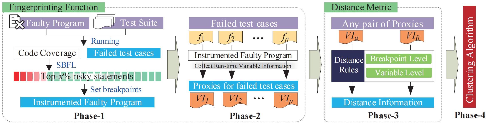
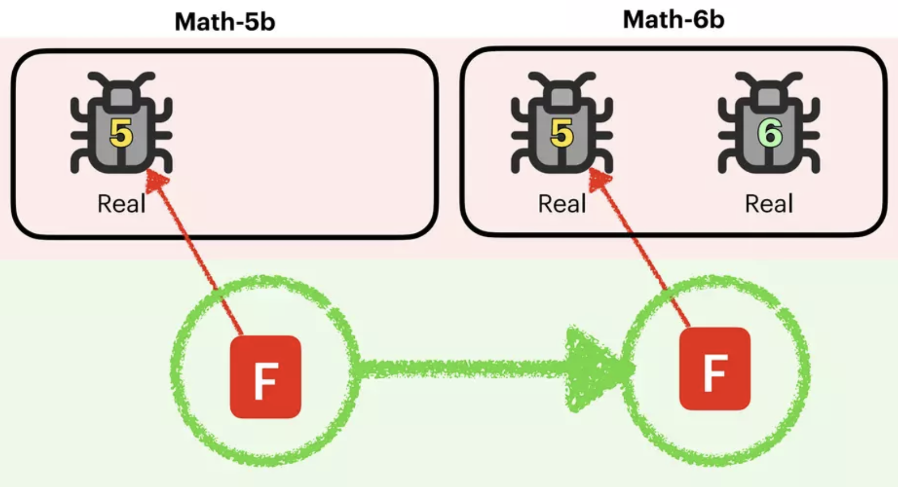

# Artifact for the Paper "ReClues: Representing and Indexing Failures in Parallel Debugging with Program Variables"

This is the artifact for the ICSE 2024 research paper "***ReClues: Representing and Indexing Failures in Parallel Debugging with Program Variables***". 
ReClues is a novel failure indexing approach on the basis of the program variable-based failure proximity proposed by the paper, which utilizes the run-time values of program variables to represent failures, and designs a set of rules to measure the similarity between them.

## Content
[1 Project Summary](#1-project-summary) [2 Project Structure](#2-project-structure) [3 Framework](#3-framework) [4 Dataset](#4-dataset) 

## 1 Project Summary

This artifact supplies the completed version of the running example in the paper, as well as the code and the dataset of the experiment.

## 2 Project Structure

##### The meaning of the subfolders and files in this project:

  + ***detailedExample.pdf***
  
    The completed version of the running example in the paper.

  + ***code/***
    + `Phase-1/`
      + `getSpectrum.py` gets the spectrum from the code coverage.
      + `SBFL_Formula_DStar.py ` calculates suspiciousness for each program statement.
    + `Phase-2/`
      + `collect_VIs.py`  collects the run-time variable information for each failed test case.
      + `get_GDB_var.py` is the collection script using GDB.
      + `get_JDB_var.py` is the collection script using JDB.
    + `Phase-3/`
      + `caldistance_5%.py`, `caldistance_10%.py`, `caldistance_15%.py`, and `caldistance_20%.py` calculate distance between a pair of failures with  the Top-5%, Top-10%, Top-15%, and Top-20% riskiest statements, respectively.
      + `caldistance_bonly.py` and `caldistance_vonly.py` calculate distance between a pair of failures by using only breakpoint level information and 
only variable level information, respectively.
    + `Phase-4/`
      + `k-medoids.py` is the clustering algorithm, which enables all failures to be indexed to their own root cause.
  + ***dataset/***
    * `SIR/`
      * `$project/src` is the clean version of the C benckmark project.
      * `$project/AllMutants ($project).xls` is the mutants used to create faulty versions.
    * `Defects4J/`
      * `project/$project` is the faulty version of the Java benckmark project.
      * `test/$project` is the corresponding test cases.

  + ***runningExample_code/***
    * `example/`

      * `example_faulty.java` gives the faulty version of the running example in the paper.
      * `example_fixed.java` gives the fixed version of the running example in the paper.
      * `example_hasFault1.java` gives  the faulty version of the running example only containing Fault1.
      * `example_hasFault2.java` gives  the faulty version of the running example only containing Fault2.
    * `exampleTest/`

      * `exampleTest.java` gives all test cases of the running example. 

## 3 Framework

##### The overview of ReClues is shown as follows:

The mapping relationship between the phases in the framework and the source code is as follows:

`Phase-1` : **[getSpectrum.py](code/Phase-1/getSpectrum.py)** and **[SBFL_Formula_DStar.py](code/Phase-1/SBFL_Formula_DStar.py)**

`Phase-2` : **[collect_VIs.py](code/Phase-2/collect_VIs.py)**,  **[get_GDB_var.py](code/Phase-2/get_GDB_var.py)** and **[get_JDB_var.py](code/Phase-2/get_JDB_var.py)**

`Phase-3` : **[caldistance_5%.py](code/Phase-3/caldistance_5%25.py)**, **[caldistance_10%.py](code/Phase-3/caldistance_10%25.py)**, **[caldistance_15%.py](code/Phase-3/caldistance_15%25.py)**, **[caldistance_20%.py](code/Phase-3/caldistance_20%25.py)** and

&emsp;&emsp;&emsp;&emsp;&emsp; **[caldistance_vonly.py](code/Phase-3/caldistance_vonly.py)**, **[caldistance_bonly.py](code/Phase-3/caldistance_bonly.py)**

`Phase-4` : **[k-medoids.py](code/Phase-4/k-medoids.py)**

## 4 Dataset

* **[`dataset/SIR`](dataset/SIR/)**:
  
  * We download four C projects from [SIR](https://sir.csc.ncsu.edu/portal/index.php): *flex*, *grep*, *gzip*, and *sed*, and then based on which create 1-bug, 2-bug, 3-bug, 4-bug, and 5-bug faulty versions by employing mutation strategies.
  * To create an *r*-bug faulty version (*r* = 1, 2, 3, 4, 5), we inject 1, 2, 3, 4, and 5 mutant(s) into the clean program, respectively. We employ an existing tool [ReClues/mutate.py: This is a simple script to perform mutation testing on c/c++ like programs (github.com)](https://github.com/ReClues/mutate.py) to perform mutation.
  
* **[`dataset/Defects4J`](dataset/Defects4J/)**:

  * We download five Java projects from [Defects4J](https://github.com/rjust/defects4j): *Chart*, *Closure*, *Lang*, *Math*, and *Time*, and then based on which search for 1-bug, 2-bug, 3-bug, 4-bug, and 5-bug faulty versions, according to the search strategy proposed by:
  
    `"Searching for Multi-Fault Programs in Defects4J", Gabin An, Juyeon Yoon, Shin Yoo, SSBSE 2021`
  
  * The following picture is from their **[`slides`](https://www.slideshare.net/GabinAn1/searching-for-multifault-programs-in-defects4j)**, showing how they transplant fault-revealing test cases to detect more faults that existed in the original faulty version. 
  
      
  
  
  * For more details regarding the generation of Defects4J multi-fault versions, please refer to [coinse/Defects4J-multifault: Artifact of "Searching for Multi-Fault Programs in Defects4J", SSBSE 2021 (github.com)](https://github.com/coinse/Defects4J-multifault).
  
